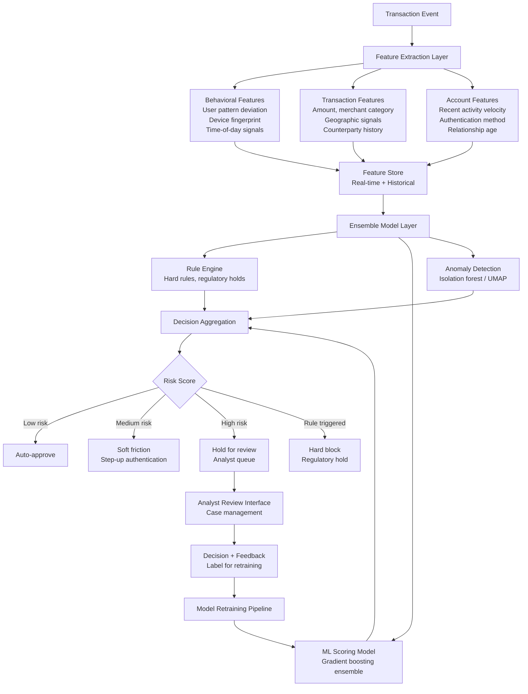
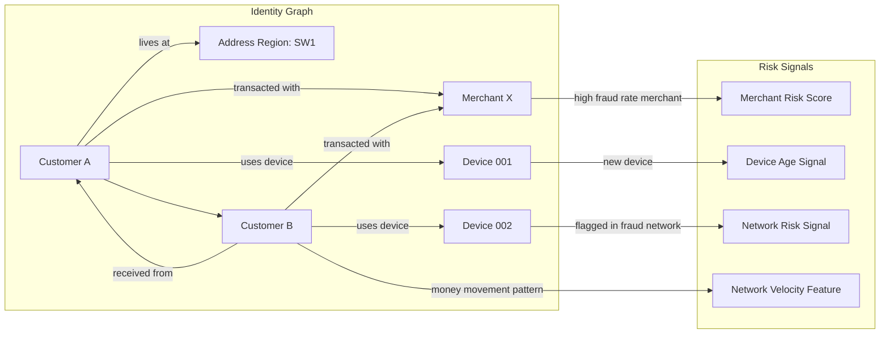
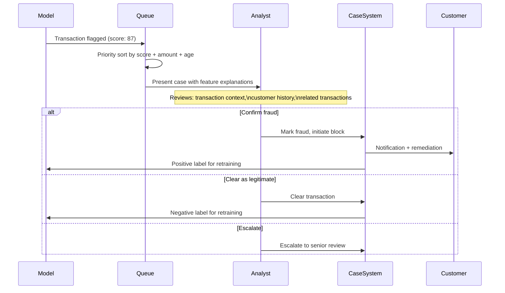

# Financial Fraud Detection — AI & ML Powered

This repository documents the design, architecture, and analytical approach behind an ML-powered fraud detection system built for a retail banking environment. The system was designed to screen over 1 million monthly transactions across a £24B savings portfolio, with the specific challenge of maintaining low false-positive rates without reducing fraud detection coverage.

The documentation here covers the product and systems thinking behind the implementation — the problem framing, model selection rationale, the operational tradeoffs that shaped the architecture, and the lessons from running the system in production.

---

## The Core Problem

Fraud detection in banking is not primarily a machine learning problem. It is a decision-making problem under uncertainty, with asymmetric costs, operational constraints, and a regulatory context that shapes what you can and cannot do.

The machine learning component — building models that identify suspicious transactions — is the tractable part. The harder problems are:

**The false positive cost.** Every transaction flagged as fraudulent that is not fraudulent imposes a cost: a customer is declined or asked to re-authenticate, support volume increases, trust erodes. At transaction scale, even a 0.5% false positive rate generates thousands of unnecessary customer interventions per month. The operational and customer satisfaction cost of false positives is often larger than the cost of the fraud the system prevents.

**The adversarial adaptation problem.** Fraud patterns change. A model trained on historical fraud data will degrade as fraudsters adapt their behavior to avoid the patterns that got them caught. Static models require continuous monitoring and retraining cycles that most organizations underinvest in relative to the initial build.

**The explainability constraint.** In a regulated environment, decisions that affect customers — including transaction declines or holds — must be explainable. Black-box models that produce accurate predictions but cannot provide human-readable reasoning create compliance exposure. The system must balance predictive accuracy with explainability requirements.

---

## System Architecture

---

## Model Design Decisions

### Why an Ensemble Approach

A single model optimized for accuracy will overfit to the fraud patterns present in the training data and will have a characteristic failure mode — the patterns it misses will be consistent and exploitable. An ensemble of models with different architectures and feature emphases produces a system where the failure modes are less correlated: fraud that evades one model is more likely to be caught by another.

The ensemble includes:
- A gradient boosting model (XGBoost/LightGBM) optimized for precision on known fraud patterns, trained on labeled historical fraud data
- An isolation forest for detecting statistical anomalies in transaction behavior without requiring labeled fraud examples — this catches novel fraud patterns the supervised model has not seen
- A rule engine enforcing hard regulatory requirements (sanctions screening, velocity limits, geographic restrictions) that cannot be model-dependent

### Feature Engineering: The Identity Graph Problem

The most predictive features are not transaction-level attributes — they are relational features that describe how this transaction relates to the customer's behavioral history and to patterns across the customer base.

The graph structure enables features that a transaction-level model cannot access: if Customer A sends money to Customer B, and Customer B's account was involved in a fraud cluster last month, that is a predictive signal for Customer A's transaction even if nothing about Customer A's individual behavior is unusual. Building these network features requires maintaining an identity graph — a representation of the relationships between accounts, devices, merchants, and addresses — that can be queried in real time.

### The False Positive Threshold Problem

The operating threshold for the model — the score above which a transaction is flagged — is not a technical decision. It is a business decision with customer impact implications.

Setting the threshold too low produces high recall (most fraud is caught) but high false positive rates (many legitimate customers are affected). Setting it too high produces low false positive rates but misses fraud. The optimal threshold depends on:

- The cost of a fraudulent transaction (loss amount, regulatory consequence, customer impact)
- The cost of a false positive (customer friction, support cost, churn risk)
- The volume at each risk tier (what are the analyst capacity implications of a given threshold?)

In practice, this requires maintaining a threshold adjustment process that is owned jointly by the product, risk, and operations functions — not delegated to the data science team. The threshold is a product decision, not a model parameter.

---

## Operational Architecture: The Analyst Workflow

The machine learning component of fraud detection is only as valuable as the analyst workflow that acts on its outputs. In practice, analyst capacity is the binding constraint — most organizations can build models that generate more alerts than analysts can review.

The case management system is a product in its own right. Analyst productivity is directly affected by the quality of case presentation — the features shown, the contextual information available, the workflow friction. A system that requires analysts to navigate five separate screens to make a decision will produce worse outcomes than one that surfaces the right information in a single view, regardless of model quality.

Key design decisions in the analyst interface:
- Show feature contributions (which signals drove this score) not just the score — analysts make better decisions when they understand why the model flagged a transaction
- Surface related transactions and linked accounts in context — fraud rarely occurs in isolation; showing the network context materially improves analyst accuracy
- Log analyst reasoning not just decisions — understanding why analysts clear cases that turn out to be fraud is as valuable for model improvement as the label itself

---

## Monitoring and Model Drift

### What to Monitor

Model performance in production degrades continuously. The monitoring questions are: how fast, in what direction, and how do you know before the degradation is large enough to cause material harm?

| Metric | What It Measures | Degradation Signal |
|---|---|---|
| Precision at operating threshold | What fraction of flagged transactions are actually fraud | Declining precision = rising false positive rate = increasing customer harm |
| Recall on confirmed fraud | What fraction of confirmed fraud was caught by the model | Declining recall = increasing fraud losses |
| Score distribution stability | Are the score distributions shifting over time | Distribution shift before precision/recall changes = early warning of model drift |
| False negative audit rate | Sampling confirmed fraudulent transactions to check if they were correctly scored | Catches systematic blind spots the standard metrics miss |
| Feature importance stability | Are the predictive features stable or shifting | Feature importance changes = fraud pattern evolution requiring retraining |

### The Retraining Problem

Retraining a fraud model on recent data without careful handling of label bias produces a model that is worse than the one it replaces. The problem: recent fraud labels are incomplete. Fraud that occurred recently may not yet have been confirmed — chargebacks take time, investigations take time. Training on recent data treats unconfirmed fraud as legitimate transactions, which biases the model toward missing recent fraud patterns.

Mitigation requires:
- Using only labels that have aged sufficiently for fraud confirmation to be reliable
- Supplementing aged labels with a held-out validation set that represents confirmed recent fraud patterns
- Monitoring for label bias in retraining data before deploying a new model version

---

## Key Learnings

**The model is rarely the bottleneck.** Analyst capacity, case management quality, and the threshold calibration process have more impact on outcomes than model architecture choices within the range of reasonable approaches.

**False positives are underweighted in initial design.** The focus during build is typically on fraud detection rate. The customer impact of false positives — and the operational cost of the support volume they generate — is discovered in production and is usually larger than anticipated.

**Explainability is not optional in banking.** Models that cannot provide human-readable reasoning for their decisions create regulatory exposure and produce worse analyst outcomes. The additional complexity of maintaining explainability is justified.

**The feedback loop is the product.** A fraud model without a reliable label feedback loop from analyst decisions will degrade on a known schedule. The retraining pipeline and the processes that ensure label quality are as important as the initial model.

**Fraud patterns are adversarial.** Unlike most prediction problems, the distribution you are predicting against is actively adapting to avoid detection. Monitoring must be designed with this in mind — not just tracking whether the model is accurate on historical patterns, but actively testing for new patterns the model has not seen.
