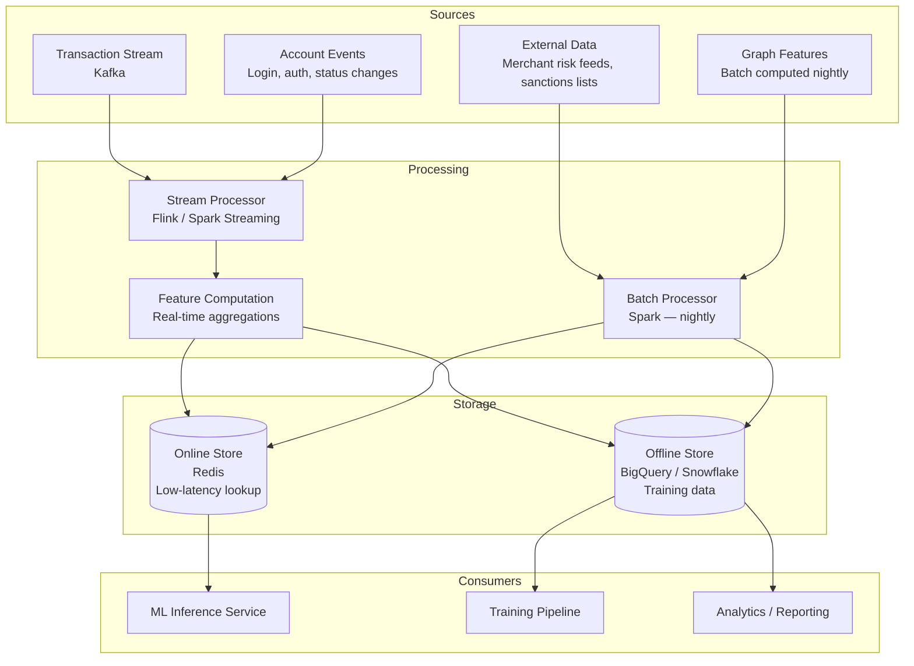
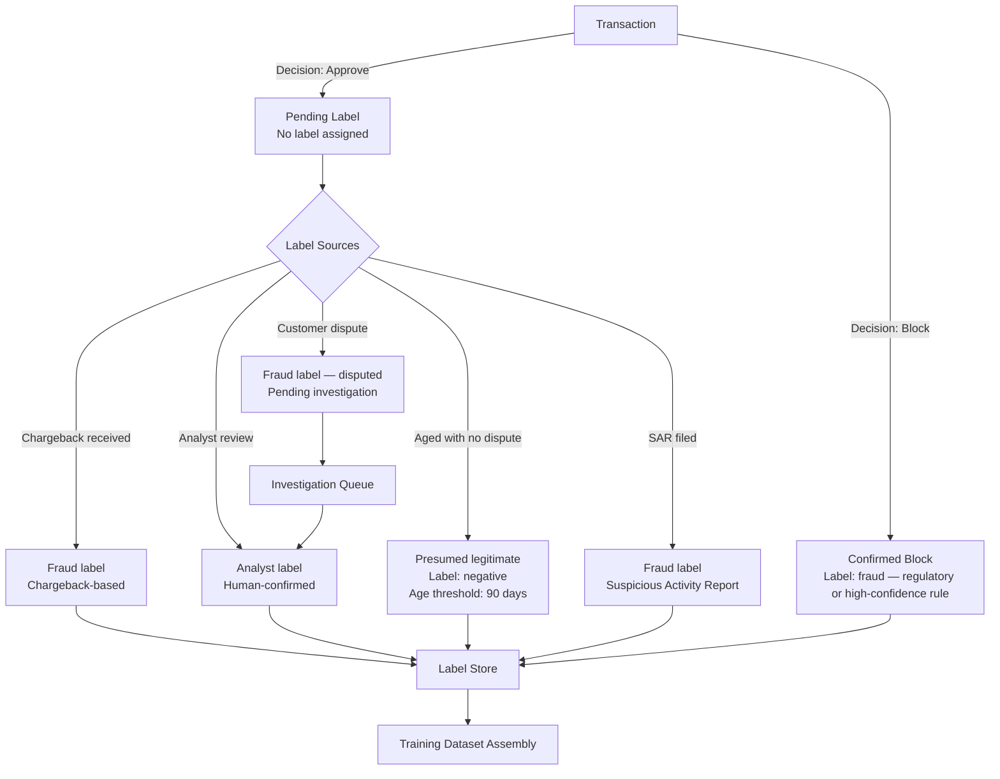
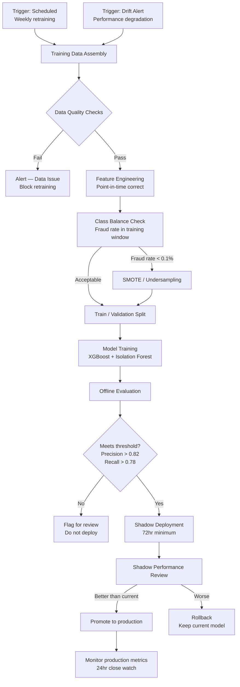

# Data Pipeline — Feature Store and Retraining Architecture

## Overview

The fraud detection model is only as good as the data pipeline that feeds it. This document covers the feature store architecture, the labeling pipeline, and the model retraining process — with specific attention to the operational failure modes that degrade data quality in production and what was done to mitigate them.

---

## Feature Store Architecture

The feature store is the central component that bridges the raw event stream and the ML inference layer. It serves two functions: online feature serving (low-latency lookups at inference time) and offline feature access (training data assembly).

### Online Store (Redis)

Serves real-time feature lookups during inference. Key characteristics:
- Sub-5ms p99 read latency requirement
- Features stored as serialized feature vectors keyed by entity ID (customer ID, device fingerprint, merchant ID)
- TTL-based expiry to prevent stale feature serving (entity-specific TTLs: 15 min for account state, 1 hour for device/merchant risk)
- Write-through on transaction events; no polling

### Offline Store (BigQuery / Snowflake)

Stores the complete feature history used for training data assembly. Key considerations:

**Point-in-time correctness**: Training features must reflect the feature values at the time the transaction occurred — not the current values. An account risk score computed today on a transaction from 60 days ago will incorporate information that was not available at decision time, introducing look-ahead bias. The offline store uses event timestamps to enable point-in-time correct feature retrieval for training dataset assembly.

**Feature schema versioning**: Features evolve — new features are added, existing features are redefined, feature computation logic changes. The offline store maintains schema versioning so training datasets can be assembled from a consistent feature schema, and historical training runs can be reproduced with the same feature definitions.

---

## Labeling Pipeline

Labels (fraud / legitimate) are the primary asset in a supervised fraud model. Label quality is the primary determinant of model quality — more than architecture or feature engineering choices within a reasonable range.

### Label Quality Problems

**Incomplete labels**: A transaction may be genuinely fraudulent but never generate a chargeback — the customer may not notice, may not dispute, or may dispute outside the standard chargeback window. The labeled negative class (legitimate transactions) is contaminated with unlabeled fraud, which biases the model toward underestimating fraud risk.

Mitigation: Use confirmed fraud labels only, not absence-of-dispute as a positive legitimacy signal. Accept that the model will be trained on a dataset where some negatives are actually fraud; monitor for this through false negative audit sampling.

**Label delay**: Chargebacks arrive 30–90 days after the fraudulent transaction. Training on recent data requires handling this delay — transactions from the last 90 days should be excluded from the training dataset or treated with a separate labeling approach.

**Label flipping**: Dispute investigation sometimes reverses initial fraud labels (a transaction initially labeled legitimate is later confirmed as fraud, or vice versa). The label pipeline must handle label updates and propagate corrections to the training dataset.

**Analyst label quality**: Human-reviewed cases have high label quality for clear-cut cases. For ambiguous cases — where the analyst was uncertain — labels are noisy. Recording analyst confidence and case ambiguity enables downstream filtering of uncertain labels from the training dataset.

---

## Model Retraining Pipeline

### Training Data Window

The training window (18 months of labeled transactions) is not arbitrary. Shorter windows:
- Produce models that fit recent patterns well but miss infrequent fraud types that cycle in and out of activity
- Are more susceptible to seasonal variation (holiday fraud patterns, tax season patterns)

Longer windows:
- Include fraud patterns that are no longer active, diluting the signal from current patterns
- Increase training time and data infrastructure cost without proportional accuracy benefit

The 18-month window was selected empirically: it produces better validation performance than 6-month or 12-month windows, with diminishing returns beyond 18 months.

### Data Quality Checks

Before any training run, the following checks must pass:

| Check | Condition | Failure Action |
|---|---|---|
| Label completeness | Fraud rate in training window within expected range (0.2%–0.5%) | Block — potential label pipeline failure |
| Feature availability | All required features present for > 95% of training records | Block — potential feature pipeline failure |
| Feature schema match | Training feature schema matches current production schema | Block — schema drift |
| Label age | Less than 5% of labels are less than 90 days old | Warn — potential label quality issue |
| Data volume | Training dataset at least 500K labeled records | Block — insufficient data |

### Performance Thresholds for Promotion

A new model is not promoted to production unless it meets all of the following on the held-out validation set:

| Metric | Minimum Threshold | Rationale |
|---|---|---|
| Precision at operating threshold | 0.82 | Below this, false positive volume exceeds analyst capacity |
| Recall on confirmed fraud | 0.78 | Below this, fraud loss increases materially |
| AUC-ROC | 0.94 | Sanity check on overall discrimination |
| Calibration error | < 0.05 (Brier score component) | Ensures threshold tuning is meaningful |
| Performance on tail fraud types | Within 10% of current model per fraud type | Prevents regression on rare but important fraud types |

These thresholds were calibrated against the operating cost model — the cost of false positives and the cost of missed fraud — and reviewed with the risk and finance functions.

---

## Feature Drift Monitoring

Feature drift — changes in the distribution of input features — is an earlier warning signal of model degradation than accuracy metrics, because accuracy metrics require labels (which arrive with delay) while feature distributions can be monitored in real time.

Key drift monitors:

**Population Stability Index (PSI)** computed daily for each feature against a 30-day baseline. PSI > 0.2 triggers a review; PSI > 0.25 triggers a retraining evaluation.

**Feature correlation stability**: If features that were strongly correlated in training become uncorrelated in production, the model's internal representation of the problem has become misaligned with reality.

**Score distribution stability**: The distribution of model output scores should be stable over time when calibrated to the fraud base rate. Score distribution shift before precision/recall changes is the clearest early warning of model drift.

All drift metrics are surfaced in the monitoring dashboard (see `monitoring-playbook.md`) and reviewed weekly by the fraud product and data science teams.
