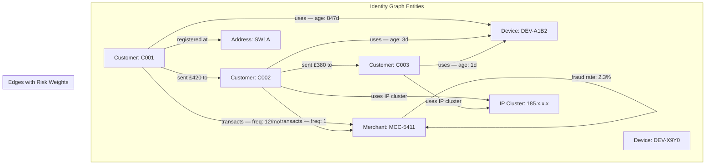
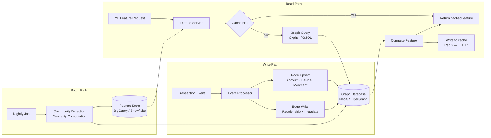

# Identity Graph — Feature Engineering and Architecture

## Purpose

The identity graph is the component of the fraud detection system that enables relational feature computation — features that describe how a transaction relates to other entities (accounts, devices, merchants, addresses) in the system, not just how it relates to the transacting customer's own history.

This document covers why the identity graph exists, what it stores, how features are computed from it, and the operational tradeoffs involved in maintaining it.

---

## The Problem That Motivated the Identity Graph

Transaction-level fraud detection — looking at each transaction in isolation — misses a class of fraud that is only visible in relationships. Consider:

- A legitimate customer transacts with a merchant that processes a high volume of fraudulent transactions from other customers. The individual transaction looks normal; the merchant's network position is the signal.
- Customer A sends money to Customer B. Customer B's account was linked to a fraud cluster six weeks ago. No feature computed on Customer A's individual behavior will capture this.
- A new device is used across three accounts within 48 hours. Each account-device pair looks normal individually. The device-sharing pattern is the signal.

These are network features. They require a representation of the relationships between entities — not just the history of individual entities.

---

## Graph Schema

### Node Types

| Node Type | Key Attributes | Update Frequency |
|---|---|---|
| Customer | Customer ID, account age, KYC tier, risk score, dispute history | Per event |
| Device | Device fingerprint, device age, account linkage count, OS/browser profile | Per login event |
| Merchant | MCC code, fraud rate (30/90/180d), transaction volume, dispute rate | Daily aggregate |
| Address | Region, fraud incidence rate, account density | Weekly |
| IP Cluster | CIDR range, geographic mapping, abuse score | Daily |

### Edge Types

| Edge Type | Semantics | Risk Weight Implication |
|---|---|---|
| Customer — Device | This customer has used this device | Weight increases with device-account ratio; a device used by 5+ accounts is high risk |
| Customer — Merchant | Transaction relationship | Weight reflects merchant fraud rate and recency |
| Customer — Address | Registered or used address | Mismatch between registered and transaction address is a signal |
| Customer — Customer | Money movement | Directional; used for velocity and network cluster computation |
| Device — IP Cluster | Device has appeared on this IP range | Enables detection of shared infrastructure across accounts |

---

## Feature Computation

Graph features are computed as embeddings at query time — not precomputed and stored, except for expensive features that are batch-computed and cached.

### Real-Time Features (< 50ms SLA)

These features are computed on every transaction and feed directly into the ML scoring models:

**Device Risk Score**
- Number of distinct accounts linked to this device in the last 30 days
- Age of the device-account association (new associations are higher risk)
- Whether the device has been linked to any account with confirmed fraud history

**Counterparty Risk (for payments/transfers)**
- Fraud cluster proximity: shortest path distance in the customer-customer graph to any node with confirmed fraud history within 90 days
- Counterparty account age: new accounts receiving money are elevated risk
- Velocity: total value flowing to/from this counterparty in the last 7/30 days

**Merchant Risk Score**
- 30-day fraud rate at this merchant (chargebacks + confirmed fraud / total transactions)
- Dispute rate trend (rising dispute rates are a leading indicator of merchant compromise)
- Whether this is the customer's first transaction at this merchant

### Batch-Computed Features (Updated Daily)

These features are expensive to compute in real time and are refreshed daily. They are stored in the feature store and looked up at inference time:

**Network Community Risk**
- Community detection algorithm (Louvain method) run nightly to identify clusters of highly interconnected accounts
- Each account is assigned a community risk score based on the aggregate fraud incidence within its community
- This feature catches organized fraud rings that operate through account clusters with no obvious individual signals

**Account Centrality in Money Flow Networks**
- Accounts that sit at the center of large money flow networks — receiving from many sources and distributing to many destinations — are structurally suspicious even if individual transactions are within normal parameters
- Computed as betweenness centrality in the directed money movement graph
- Flagged when centrality is anomalously high relative to account type and transaction history

---

## Graph Storage and Query Architecture

### Latency Budget

The 50ms real-time SLA for graph features is a hard constraint — it is set by the overall transaction scoring latency requirement. Graph query latency is the primary driver of end-to-end scoring latency because relational queries are inherently more expensive than tabular lookups.

Techniques used to hit the SLA:
- Indexed node lookups by customer ID, device fingerprint, and merchant ID
- 1-hop query depth for real-time features (no multi-hop traversals in the critical path)
- Redis cache for frequently queried nodes (cache TTL: 1 hour for device and merchant risk scores, 15 minutes for account-level features)
- Fallback feature set when graph is unavailable — the model degrades gracefully with reduced feature set rather than blocking

### Graph Size and Retention

At 1M+ monthly transactions, the graph grows approximately 800K edges per month at current relationship density. Retention policy:
- Active edges (queried in last 90 days): retained in hot storage
- Inactive edges (90–365 days): compressed and retained in warm storage, queryable with higher latency
- Edges older than 365 days: archived; removed from graph database
- Node records retained for 7 years per regulatory requirement, but only summary metadata is kept in the active graph

---

## Privacy and Data Governance Considerations

The identity graph is inherently a surveillance system. It tracks behavioral relationships between individuals at transaction granularity. This creates regulatory exposure under data protection frameworks and operational risk if the data is misused.

Key controls in place:

**Data Minimization**
- Edges store relationship metadata (frequency, recency, amount range buckets) not individual transaction records — individual transactions are stored in the transaction database, not the graph
- The graph is queried for features; it is not used as a reporting database

**Access Control**
- Graph query access is restricted to the fraud scoring service account and the fraud analytics team
- Analyst interface does not expose raw graph data — it surfaces computed risk features and relationship counts, not account linkage lists

**Audit Logging**
- All graph queries are logged with the requesting service, query type, and queried node IDs
- Audit log is reviewed monthly for anomalous query patterns

**Data Subject Rights**
- Account deletion requests trigger a graph cleanup job that removes the customer node and all associated edges
- This degrades the graph's accuracy for network feature computation — which is the correct tradeoff; data subject rights take precedence over model performance
