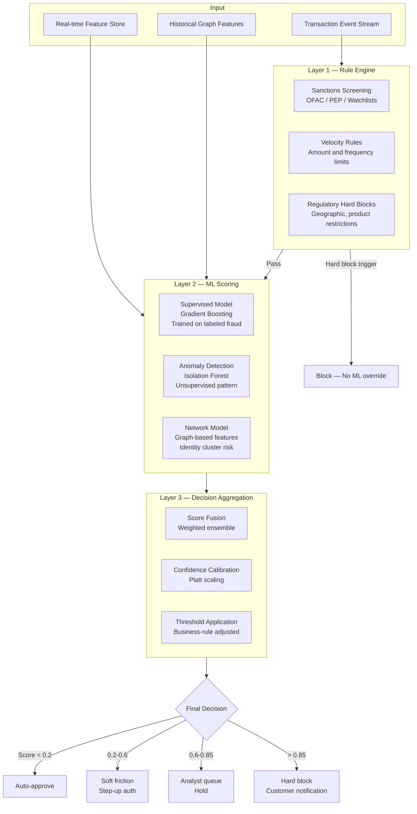

# Ensemble Model Architecture — Design Rationale and Implementation Notes

## Why This Document Exists

This document captures the reasoning behind the architectural choices in the fraud detection ensemble — not just what was built, but why, and what was learned about the tradeoffs. Model architecture decisions made without this context tend to be revisited unnecessarily or abandoned before the problems they were designed to solve become visible.

---

## The Fundamental Problem with Single-Model Fraud Detection

A single model optimized for accuracy will have a characteristic failure mode. The patterns it misses will be consistent, and a sophisticated adversary can identify and exploit those blind spots. More importantly, the failure modes of a well-trained gradient boosting model and an anomaly detection model are structurally different — a gradient boosting model trained on historical labeled fraud will miss novel fraud patterns it has not seen; an isolation forest will catch distributional anomalies but will generate false positives on unusual but legitimate behavior.

An ensemble approach does not eliminate these failure modes. It reduces the correlation between them.

---

## The Three-Layer Architecture

### Layer 1: Rule Engine

The rule engine is not a fallback for when machine learning fails — it is a first-pass filter that handles cases where the answer is definitively known without needing probabilistic reasoning. A transaction that triggers a sanctions hit should be blocked regardless of what any model predicts. A transaction that exceeds a regulatory velocity limit is blocked by law, not by ML judgment.

The rule engine runs first. Transactions that hit hard rules never reach the ML layer. This matters because:

- It keeps regulatory decisions out of probabilistic model logic, which simplifies audit and compliance defense
- It reduces the scoring load on the ML layer (rules are cheap; model inference is not)
- It prevents adversarial actors from exploiting model uncertainty around hard-rule cases

The tradeoff: rules require ongoing maintenance. As regulatory requirements change, rules must be updated by someone with both regulatory knowledge and engineering access. Maintaining this as a separate, clearly owned layer reduces the risk of rule drift.

### Layer 2: ML Scoring Models

**The Supervised Model (Gradient Boosting)**

XGBoost/LightGBM trained on labeled fraud and legitimate transaction pairs from the prior 18 months. The 18-month window is intentional: longer windows include fraud patterns that are no longer active; shorter windows underrepresent rare fraud types.

Key design choices:
- Class imbalance handling via SMOTE + cost-sensitive learning (fraud base rate ≈ 0.3% of transactions; naive training produces models that ignore the minority class)
- Feature importance monitoring as a primary drift signal — when the importance of behavioral features starts declining relative to simple transaction features, it typically precedes model accuracy degradation
- Calibrated probability outputs (not raw scores) so that the score has a meaningful interpretation as a probability estimate

**The Anomaly Detection Model (Isolation Forest)**

Trained only on legitimate transactions. Flags transactions that are statistically anomalous relative to baseline — regardless of whether the anomaly resembles historical fraud patterns.

This is the model that catches novel fraud tactics. It has a higher false positive rate than the supervised model, so its output is weighted lower in the ensemble and primarily serves to elevate the aggregate score for transactions the supervised model is uncertain about.

Operating principle: isolation forest anomaly scores are not merged directly into the ensemble score. They act as a multiplier on the supervised model score in the medium-uncertainty band (scores 0.3–0.6). This prevents the anomaly model from dominating decisions on transactions the supervised model is confident about in either direction.

**The Network Model**

Graph-based features derived from the identity graph (see `identity-graph.md`). The network model is not a separate inference model — it is a feature provider. It computes relational risk features (counterparty fraud cluster proximity, device sharing patterns, money velocity through account networks) that are consumed as inputs by the gradient boosting model.

The reason this is documented as a separate component: the network feature computation pipeline has its own latency and reliability characteristics. When graph queries are slow or unavailable, the system falls back to a degraded feature set. Knowing which features come from the graph is essential for understanding what the model's accuracy characteristics are in degraded-graph scenarios.

### Layer 3: Decision Aggregation

**Score Fusion**

The ensemble score is a weighted combination of the supervised model output and anomaly model modifier. Weights are:
- Supervised model: 0.75
- Anomaly model modifier: 0.25 (applied only in medium uncertainty band)

Weights were determined empirically through offline validation against a held-out labeled dataset. They are reviewed quarterly.

**Confidence Calibration**

Raw model probability outputs are not well-calibrated — the model may predict 0.85 fraud probability on a transaction that is only fraudulent 60% of the time. Platt scaling applied post-hoc corrects this. Well-calibrated scores matter for threshold setting: if the score is not calibrated, threshold tuning based on score values produces unpredictable results.

**Threshold Application**

The thresholds at each tier (auto-approve / soft friction / analyst review / hard block) are not fixed model parameters. They are business decisions reviewed monthly by the product, risk, and operations functions jointly.

The threshold for soft friction (step-up authentication) is set to maintain analyst queue volume within capacity — if the queue exceeds analyst capacity by more than 15%, the threshold is raised. If fraud losses are rising, the threshold is lowered. This is an operational feedback loop, not a data science function.

---

## Feature Engineering Summary

Full feature documentation is in `identity-graph.md`. Key categories:

| Feature Category | Examples | Primary Model Consumer |
|---|---|---|
| Transaction-level | Amount, merchant category code, transaction channel | Supervised model |
| Behavioral | Time-of-day deviation, frequency deviation, amount deviation from baseline | Supervised model |
| Device | Device age, device-account association count, device risk score | Supervised model |
| Geographic | Transaction location vs. registered address, velocity across geographies | Supervised + rule engine |
| Network | Counterparty fraud cluster proximity, money velocity, device sharing | Network feature layer |
| Account state | Recent authentication type, days since last contact, dispute history | Supervised model |

---

## Model Versioning and Deployment

Models are versioned and stored in the model registry with full metadata: training data date range, validation set performance, feature schema version, threshold values at deployment time.

Deployment is shadow mode first: the new model runs against live traffic alongside the current production model for a minimum of 72 hours before becoming the decision-making model. Shadow mode performance is compared against current model on the same transactions before any cutover.

This is not optional. A model that performs well on offline validation but degrades on live traffic is common — the offline dataset does not fully represent the live feature distribution, and shadow mode catches this before it affects customer decisions.

---

## Explainability Implementation

SHAP (SHapley Additive exPlanations) values are computed for every transaction that reaches the analyst queue or results in a block. SHAP values are surfaced in the analyst interface showing which features drove the model score, and in customer-facing communication for block decisions.

Why SHAP and not LIME: SHAP has consistency guarantees that LIME does not — the explanations are guaranteed to sum to the model output, which makes them defensible in regulatory review. LIME explanations are locally faithful but globally inconsistent; in a regulated environment, that inconsistency creates compliance exposure.

The explainability pipeline adds approximately 40ms to inference time for analyst-queue and block decisions. Auto-approve decisions do not compute SHAP values — the latency cost is not justified for decisions that are not being surfaced to any human.
