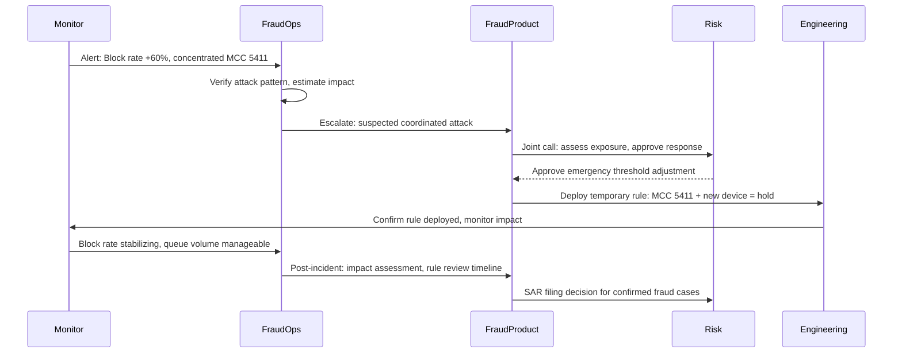

# Production Monitoring Playbook — Fraud Detection System

## Purpose

This playbook defines the monitoring framework for the fraud detection system in production: what is monitored, at what frequency, what thresholds trigger action, and who is responsible for the response. It is intended as both operational documentation and a reference for onboarding new team members to the system.

---

## Monitoring Philosophy

Three things are true about fraud model monitoring that distinguish it from most ML monitoring problems:

1. **Labels are delayed.** The ground truth — whether a transaction was actually fraudulent — arrives 30–90 days after the transaction. Monitoring approaches that rely on labeled feedback are inherently lagged; early warning must come from proxy signals.

2. **The adversary is adaptive.** Unlike most prediction problems, fraud distribution shifts are often intentional responses to the system. Monitoring must be designed to detect adversarial pattern shifts, not just natural distributional drift.

3. **The cost of false negatives and false positives are both real.** Most systems optimize for one type of error. Fraud detection must track both simultaneously, because the operational response to each is different and the business tolerance for each is different.

---

## Monitoring Dashboard — Metric Definitions

### Tier 1 Metrics (Reviewed Daily)

| Metric | Definition | Alert Threshold | Owner |
|---|---|---|---|
| **Transaction score distribution** | P10, P50, P90, P99 of model scores across all transactions | P90 shifts > 0.08 in 24h | ML Engineering |
| **Block rate** | % of transactions resulting in hard blocks | ±30% vs. 7-day trailing average | Fraud Ops |
| **Queue volume** | Transactions entering analyst review queue | > 120% of analyst daily capacity | Fraud Ops |
| **Auto-approve rate** | % of transactions auto-approved (score < threshold) | ±15% vs. 7-day trailing average | ML Engineering |
| **Step-up authentication rate** | % of transactions triggering step-up | ±25% vs. 7-day trailing average | Product |
| **Analyst decision rate** | Cases resolved per analyst per hour | < 70% of target rate | Fraud Ops |

### Tier 2 Metrics (Reviewed Weekly with Labels)

These metrics require fraud labels and are reviewed with a 30-day lag.

| Metric | Definition | Alert Threshold | Owner |
|---|---|---|---|
| **Precision at operating threshold** | TP / (TP + FP) at current decision threshold | < 0.82 for two consecutive weeks | ML Engineering |
| **Recall on labeled fraud** | TP / (TP + FN) on transactions with confirmed fraud labels | < 0.78 for two consecutive weeks | ML Engineering |
| **False negative rate by fraud type** | FN rate per fraud category (card-not-present, account takeover, authorized push payment) | Any type > 30% increase vs. prior month | Fraud Analytics |
| **Analyst agreement rate** | % of analyst decisions that agree with model score direction (high-score cases confirmed as fraud, low-score clears) | < 65% agreement = model misalignment investigation | Fraud Analytics |

### Tier 3 Metrics (Reviewed Monthly)

| Metric | Definition | Trigger |
|---|---|---|
| **Feature importance stability** | Change in top-10 feature importances vs. prior month | > 20% rank change in top-5 features triggers retraining evaluation |
| **PSI by feature** | Population Stability Index for each input feature | PSI > 0.2 for any feature triggers review |
| **Score calibration** | Brier score decomposition: reliability, resolution | Calibration error > 0.05 triggers recalibration |
| **Cost model review** | Modeled cost of false positives + missed fraud vs. actual observed costs | > 20% discrepancy triggers threshold review |

---

## Alert Response Runbooks

### Alert: Queue Volume > 120% of Analyst Capacity

This is the highest-priority operational alert. When analyst queue overflows, fraud cases age without review, which increases fraud losses and reduces the quality of label feedback.

**Immediate response (within 2 hours):**
1. Verify that the queue spike is real (not a monitoring artifact) by checking raw queue depth in the case management system
2. Check whether the spike is driven by a score distribution shift (model scoring more transactions as high-risk) or a transaction volume spike
3. If score distribution shift: check for rule engine changes, feature pipeline anomalies, or recent model deployment
4. If volume spike: escalate to analyst team lead for overtime/temporary capacity assessment

**Threshold adjustment (if score distribution shift):**
- Raising the analyst-review threshold reduces queue volume but increases fraud exposure
- This decision requires joint approval from Fraud Product and Risk
- Document the change, the reason, and the expected fraud exposure increase before implementing

**Root cause investigation (within 24 hours):**
- Identify the source of the score distribution shift
- If model drift is suspected: initiate emergency retraining evaluation
- If feature pipeline issue: resolve and assess whether decisions made during the anomaly need review

---

### Alert: Precision < 0.82 (Two Consecutive Weeks)

This indicates the model is generating too many false positives — flagging legitimate transactions as fraud at an elevated rate. Customer impact is increasing.

**Investigation checklist:**
- [ ] Review score distribution for the period — is precision declining uniformly or concentrated in a score band?
- [ ] Check feature PSI for the features most important to the precision band — is there feature drift?
- [ ] Review analyst confirmation rate for cases in the analyst queue — are analysts clearing an increasing fraction of cases?
- [ ] Check whether a recent model deployment preceded the precision decline
- [ ] Check whether a specific transaction type or customer segment is driving the precision decline

**Response options (in escalating order):**
1. Threshold adjustment (raises auto-approve floor, reduces cases reaching analyst, accepts some increase in fraud miss rate)
2. Feature investigation and recomputation if feature drift is identified
3. Emergency model retraining if root cause is model drift

---

### Alert: Recall < 0.78 (Two Consecutive Weeks)

This indicates the model is missing fraud — fraud losses are increasing.

**Investigation checklist:**
- [ ] Review false negative cases from the analyst queue — what fraud types are being missed?
- [ ] Check whether any specific merchant category, channel, or transaction type has elevated FN rate
- [ ] Review score distribution for confirmed fraud transactions — are they scoring lower than expected?
- [ ] Check whether new fraud patterns (not present in training data) are driving the FN increase
- [ ] Review recent fraud reports and external threat intelligence for new fraud typologies

**Response options:**
1. If new fraud typology identified: add targeted rule(s) to the rule engine as a bridge while retraining is initiated
2. If feature drift is the cause: address feature pipeline issues and initiate retraining
3. If model drift: initiate emergency retraining

---

### Alert: Feature PSI > 0.2

Population Stability Index exceeding 0.2 indicates meaningful distributional shift in an input feature. This is an early warning indicator — model accuracy may not yet be affected, but it will be if the shift persists.

**Investigation:**
1. Identify which feature(s) triggered the alert
2. Check the data pipeline for that feature — is there a computation change, data source change, or data quality issue?
3. If pipeline issue: resolve and verify feature distribution returns to baseline
4. If legitimate distributional shift (e.g., new product launch changes customer behavior): initiate retraining with updated training data that reflects the new distribution

---

## Fraud Type Classification Reference

For use in false negative rate monitoring and analyst escalation decisions.

| Fraud Type | Definition | Primary Signals | Model Strength |
|---|---|---|---|
| Card-Not-Present (CNP) | Fraudulent use of card credentials for online purchases without physical card present | Merchant category, device, geographic mismatch | High |
| Account Takeover (ATO) | Unauthorized access to legitimate customer account | Authentication anomalies, device change, behavioral shift | High |
| Authorized Push Payment (APP) | Customer is deceived into authorizing payment to fraudster | Counterparty risk, social engineering signals, new payee | Medium — hard to distinguish from legitimate authorized transfers |
| First-Party Fraud | Customer fraudulently claims fraud on their own transactions | Account age, dispute history, behavioral signals | Low — intentionally deceptive |
| Identity Fraud (New Account) | Fraudster opens account using stolen identity | KYC verification quality, document authenticity signals, address/device patterns at onboarding | Medium |
| Money Mule | Legitimate account holder used (wittingly or not) to move fraud proceeds | Network centrality, inflow/outflow velocity, counterparty cluster | Medium |
| Synthetic Identity | Account created using fabricated or composite identity | KYC signal quality, thin credit file, behavioral patterns of accounts with no prior transaction history | Low — limited historical signal |

---

## Incident Response — Coordinated Fraud Attack

When monitoring signals suggest a coordinated fraud attack (multiple metrics spiking simultaneously, concentrated in a specific merchant, channel, or customer segment), the response is escalated beyond operational monitoring:

**Post-incident requirements:**
- Incident report within 24 hours: attack vector, estimated fraud losses, response actions taken, timeline
- Regulatory notification assessment: does the incident meet the reporting threshold for the applicable regulatory framework?
- Model retraining evaluation: does the attack represent a new pattern that should be incorporated into training data?
- Rule review: are emergency rules still needed, or can they be replaced by model updates?
