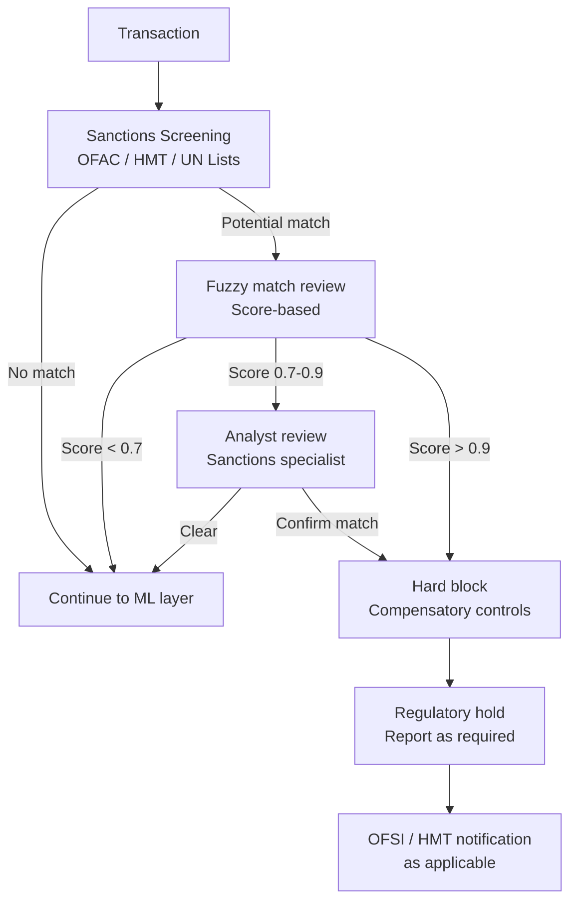

# Regulatory Compliance Framework — Fraud Detection in Regulated Banking

## Purpose

Fraud detection systems in regulated banking environments operate within a compliance framework that constrains model design, decision explainability requirements, data retention obligations, and reporting thresholds. This document captures the regulatory considerations that shaped the system design and the compliance controls in place.

This is not legal advice and does not substitute for review by qualified legal and compliance counsel. It documents the product and engineering decisions made in response to regulatory requirements as interpreted by the compliance function.

---

## Applicable Regulatory Frameworks

The system was designed for a UK retail banking environment. Key frameworks:

| Framework | Scope | Primary Compliance Obligations |
|---|---|---|
| FCA Handbook (SYSC) | Systems and controls for regulated firms | Adequate fraud controls, governance, senior manager accountability |
| Payment Services Regulations 2017 | Payment transaction fraud | Liability allocation for unauthorized transactions, reporting thresholds |
| UK GDPR / Data Protection Act 2018 | Personal data processing | Lawful basis, automated decision-making rights, data minimization |
| Money Laundering Regulations 2017 | AML / sanctions compliance | Customer due diligence, suspicious activity reporting, sanctions screening |
| PCI DSS | Card payment data | Data security standards for card transaction handling |

---

## Automated Decision-Making Compliance (UK GDPR Article 22 Equivalent)

UK GDPR provides individuals with rights related to automated decisions that have legal or similarly significant effects. Transaction blocking and fraud holds can constitute such decisions.

### When Article 22 Equivalent Applies

A transaction block or fraud hold that prevents a customer from accessing their funds or completing a payment is likely to be a "significant effect" on that individual. This means:

- The decision must be based on a lawful basis (legitimate interests for fraud prevention is the applicable basis in most cases)
- The customer must be able to obtain human review of the decision
- The decision must be explainable in terms the customer can understand

### Implementation

**Explainability**: SHAP values computed for all block and hold decisions are translated into customer-facing explanations. These explanations use plain language, not model feature names. The mapping from feature names to plain language explanations is maintained in the explainability configuration and reviewed by the compliance function before any changes.

**Human review right**: Every block or hold decision includes information about how the customer can request human review. The case management system routes review requests to the analyst team with a maximum 72-hour SLA (exceeding the regulatory minimum where specified).

**Legitimate interests assessment**: A Legitimate Interests Assessment (LIA) is maintained for the fraud detection processing. It is reviewed annually and when processing activities change materially. The LIA documents the fraud prevention purpose, the necessity assessment, and the balancing test.

---

## Sanctions Screening

Sanctions screening is a hard regulatory requirement — a transaction involving a sanctioned party must be blocked regardless of model output.

Sanctions list updates are applied within 24 hours of publication. The update pipeline is monitored with alerts for any delay exceeding the SLA. Sanctions screening runs on every transaction and every counterparty — it is not sampled.

---

## Suspicious Activity Reporting (SAR)

When the fraud detection system identifies transactions or account behavior that meets the threshold for a suspicious activity report, the SAR filing process is initiated. SARs are filed with the National Crime Agency (NCA) under the Proceeds of Crime Act 2002.

### SAR Triggers

| Trigger Type | Description | Analyst Role |
|---|---|---|
| High-confidence fraud confirmation | Analyst confirms fraudulent transaction with total suspected proceeds above threshold | Complete SAR within 5 business days |
| Account closure for fraud | Account closed due to confirmed fraud activity | SAR required within 30 days |
| Structuring suspected | Transaction pattern consistent with deliberate structuring to avoid reporting thresholds | Analyst escalates to MLRO for SAR decision |
| Sanctions match confirmed | Confirmed sanctions match | MLRO files SAR immediately, regulatory notification as required |
| Money mule network identified | Network analysis identifies coordinated mule activity | MLRO files consolidated SAR for the network |

### Tipping-Off Prohibition

Once a SAR has been filed or is being considered, the customer must not be informed in any way that a SAR is being filed or that they are under suspicion — this is the "tipping-off" prohibition under POCA 2002.

This creates a specific operational constraint: customer communications around holds and blocks for cases where a SAR is in process must be carefully worded. The communications templates used for fraud holds are reviewed by the compliance function to ensure they do not inadvertently disclose SAR-related information.

---

## Chargeback and Unauthorized Transaction Liability

Under the Payment Services Regulations 2017, the liability framework for unauthorized transactions is:

- The payment service provider is liable for unauthorized transactions unless the customer acted fraudulently or with gross negligence
- The customer bears a maximum liability of £35 for unauthorized transactions resulting from lost/stolen instruments (unless they failed to protect their credentials)
- The payment service provider must refund an unauthorized transaction by the end of the next business day after being notified

The fraud detection system's role in this framework is twofold:

1. **Prevention**: Blocking fraudulent transactions before they complete eliminates the liability
2. **Evidence**: When a customer disputes a transaction as unauthorized, the system's records — model score, features, decision rationale — are used to assess whether the dispute should be upheld or whether there is evidence of customer negligence

Case records are retained for 6 years for this purpose (the limitation period for contractual claims in England and Wales).

---

## Data Retention Schedule

| Data Type | Retention Period | Basis |
|---|---|---|
| Transaction records | 6 years | Regulatory requirement (PSRs, AML) |
| Fraud model decisions (scores, features, rationale) | 6 years | Evidence for dispute resolution |
| SAR records | 5 years from filing | POCA 2002 requirement |
| Analyst review records | 6 years | Audit and dispute evidence |
| Identity graph node records | 7 years | AML regulatory requirement |
| Model training data | 3 years | Reproducibility for regulatory review |
| Customer communications | 6 years | Evidence for disputes and regulatory review |

---

## Model Governance and Senior Manager Accountability

Under the FCA Senior Managers and Certification Regime (SM&CR), the Senior Manager responsible for fraud systems must be identified, and their responsibilities documented in a Statement of Responsibilities.

Key governance requirements:

**Model Risk Management**: The fraud model is classified as a material model under the firm's model risk management framework. This requires:
- Pre-deployment validation by an independent validation team
- Regular performance reviews against defined thresholds
- Documentation of model limitations and known failure modes
- Board-level reporting on material model performance changes

**Audit Trail**: All model changes — parameters, thresholds, features, rules — are logged with the responsible individual, date, and documented rationale. The audit trail must be producible for regulatory review within 48 hours of request.

**Change Management**: Changes to the fraud model that are material (defined as changes expected to affect > 5% of transaction outcomes) require pre-implementation approval from the Risk function and notification to the Senior Manager.
