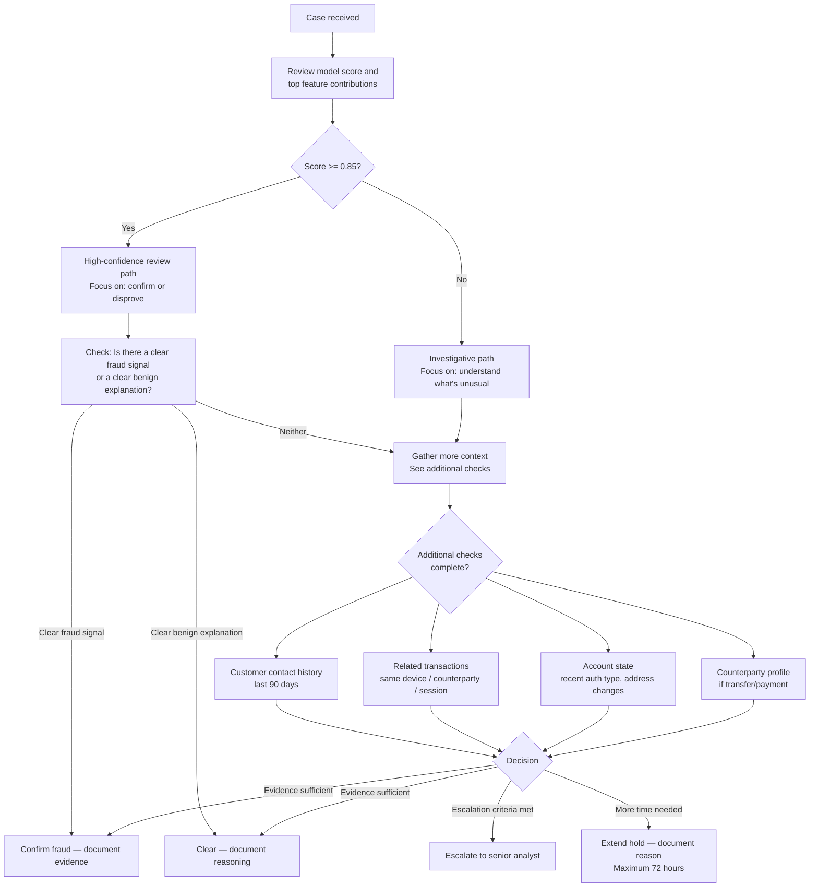

# Analyst Decision Guide — Fraud Case Review

## Purpose

This guide defines the decision framework for fraud analysts reviewing cases in the analyst queue. It covers how to interpret model outputs, what additional information to gather, how to reach a decision, and how to document your reasoning for quality and compliance purposes.

Consistent analyst decisions are essential not just for operational quality — they directly determine the quality of labels that feed model retraining. A well-reasoned decision that is documented clearly is as valuable as the decision itself.

---

## Understanding What You Are Seeing

### The Model Score

The model score is a probability estimate: a score of 0.78 means the model estimates a 78% probability that this transaction is fraudulent, based on the features available at scoring time. It is not a certainty.

The model is good at:
- Detecting deviations from a customer's established behavioral baseline
- Identifying transactions with counterparties or at merchants with elevated fraud rates
- Flagging patterns that match historical fraud types it has been trained on

The model is limited in its ability to:
- Detect authorized push payment fraud where the customer willingly made the payment
- Assess whether contextual factors (travel, large purchase, gifting) explain unusual behavior
- Distinguish between a customer who is testing a new behavior and a fraudster

Your role is to apply judgment that the model cannot.

### Feature Contributions

The case view shows the top features that drove the model score. Use these as the starting point for your investigation — they tell you what the model "noticed." A case where the top driver is "new device + high-risk merchant" should prompt different follow-up than one where the top driver is "counterparty fraud cluster proximity."

---

## Case Review Framework



---

## Decision Criteria

### Confirm Fraud

Confirm fraud when the evidence supports a conclusion that the transaction was unauthorized or the product of deception, with sufficient confidence to act. You do not need certainty — fraud decisions are made under uncertainty. You need to be able to document why the evidence supports the fraud conclusion.

**Strong evidence factors:**

| Evidence | Signal Strength |
|---|---|
| Customer explicitly reports unauthorized transaction | High |
| Device used has been confirmed in fraud on another account | High |
| Transaction follows confirmed money-mule pattern (network context) | High |
| Merchant has active fraud investigation in progress | High |
| Counterparty account flagged as fraud-linked within 30 days | High |
| Multiple velocity signals + new high-risk counterparty | Medium-High |
| Behavioral deviation (time, amount, channel) + new device + no prior contact | Medium |

**Fraud confirmation documentation requirements:**
- Primary evidence: state the specific factors that support the fraud conclusion
- Model agreement: does the case explain why the model scored high?
- Customer status: has the customer been notified? Is a SAR filing required?

---

### Clear as Legitimate

Clear as legitimate when there is a plausible benign explanation for the transaction that is consistent with the evidence.

**Strong benign indicators:**

| Indicator | Signal Strength |
|---|---|
| Customer contacted proactively to confirm transaction | High |
| Customer recently contacted about travel / large purchase | High |
| Transaction is consistent with established pattern (same merchant, similar amount) | Medium |
| Step-up authentication completed successfully by customer | Medium |
| New device but customer has history of multiple device use | Medium |
| High-risk merchant category but customer has prior history there | Medium |

**Clear documentation requirements:**
- State the benign explanation that accounts for the model's concern
- Note any residual risk indicators that were outweighed
- If customer contact was not made, note why (e.g., clear-cut from evidence alone)

---

### Escalate

Escalate to senior analyst when:

- The case involves a potential sanctions match (even low-confidence — sanctions escalations always go to the MLRO)
- The suspected fraud proceeds exceed £10,000
- The case appears to be part of a coordinated attack (multiple similar cases from the same merchant, device cluster, or counterparty)
- A SAR filing decision is required
- You have reviewed the case for 20+ minutes and cannot reach a conclusion

**Escalation documentation**: Before escalating, document: what you reviewed, what factors you considered, why you could not reach a conclusion, and what specific expertise you need from the senior analyst.

---

## Special Case Types

### Authorized Push Payment (APP) Fraud

APP fraud is when the customer willingly authorized a payment but was deceived about the purpose or recipient. The model has limited ability to detect this at transaction time because the authorization signals are legitimate.

**Indicators that raise APP fraud suspicion:**
- New payee, large amount, unusual reference (investment, emergency, HMRC, romance)
- Customer makes contact shortly after asking about a payment they sent
- Counterparty account is newly opened or has received similar payments from multiple accounts
- Transaction reference includes language associated with investment fraud, romance fraud, or impersonation

**APP fraud process**: APP fraud cases are handled differently from unauthorized transaction fraud. The customer is the authorized initiator, which affects liability, remediation, and the appropriate communication approach. Escalate to the APP fraud specialist team if APP fraud is suspected.

---

### Account Takeover (ATO)

ATO is when a fraudster has gained access to the customer's account and is transacting as if they were the customer. The key signal is behavioral discontinuity — the account is behaving differently than it has historically.

**Strong ATO indicators:**
- Authentication from a new device + new IP range + new geographic location
- Password reset within the last 24–72 hours followed by unusual transaction
- Contact details changed (email, phone) immediately before suspicious transaction
- Multiple failed authentication attempts followed by a successful one

**ATO response**: ATO cases require account-level action, not just transaction-level. If ATO is confirmed, the account should be placed in a security hold pending customer re-authentication, in addition to reversing the fraudulent transaction.

---

## Documentation Standards

Every case decision must be documented in the case management system. The documentation must be sufficient for:
- A senior analyst to understand your reasoning without additional context
- A compliance review to assess whether the decision was appropriate
- A regulatory inquiry to understand what happened and why

**Minimum documentation for every case:**

```
Decision: [Confirm Fraud / Clear / Escalate / Extend Hold]

Primary evidence reviewed:
- [Evidence item 1]
- [Evidence item 2]

Key factors in decision:
- [Factor that most drove the decision]
- [Secondary factor if relevant]

Customer contact: [Yes — outcome / No — reason]

Fraud type (if confirmed): [Fraud type from classification guide]

SAR required: [Yes / No / Refer to MLRO for assessment]

Confidence: [High / Medium — note if medium]
```

---

## Quality Standards

Case quality is reviewed monthly. The following are quality failure indicators that will be flagged:

- Decision without documented primary evidence
- Clear decision on a case with multiple high-confidence fraud signals without documented benign explanation
- Fraud confirmation without fraud type classification
- Escalation without prior documentation of what was reviewed
- Case held beyond 72 hours without documented extension rationale

High-quality decisions — especially on difficult, ambiguous cases — are flagged for use in analyst training and onboarding.
